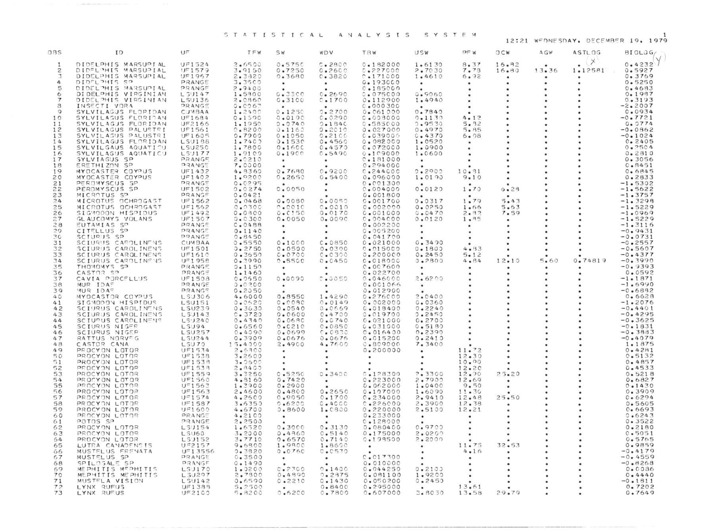

# Test OCR

This is not really expected to produce usable output.


```python
from pathlib import Path

import cv2
import matplotlib.pyplot as plt
import numpy as np
from pytesseract import image_to_string
from ipywidgets import interact
```


```python
DATA_DIR = Path('..') / 'data'
SHEET_FEED = DATA_DIR / 'old' / 'Sheetfeed'

IMAGE = str(SHEET_FEED / 'test0019.tif')
```


```python
INCHES = 32


def show_image(image):

    fig, ax = plt.subplots(1, 1)

    ax.imshow(image, cmap='gray')
    ax.axis('off')

    fig.set_size_inches(INCHES, INCHES)
    plt.show()
```


```python
gray = cv2.imread(IMAGE, cv2.IMREAD_GRAYSCALE)
gray = cv2.rotate(gray, cv2.ROTATE_90_CLOCKWISE)

print(gray.shape)
show_image(gray)
```

    (3321, 4467)


    

    


```python
ocr = image_to_string(gray, lang='eng', config='allometry.config')
print(ocr)
```

    STA TFS TTtTCAL ANALY S Tt 5S SY S TEM 1
    
    12221 WFONESDAY., DECEMBER 195 1979
    OBS ID UF TFWw SW wOV TRW USW DFW o9CcWw AGW ASTLOG BIOLaG,
    
    (VY!
    
    1 DIDELPHIS MARSUST AL YF1I524 206590 0035750 Ce 2800 02182000 126139 Be 37 16282 . ° x o.azaa¥
    
    2 DIDFLOHIS MARSUPTAL UFIS79 309150 007250 622609 0e227CO00 227030 7273 162389 13036 1212581 065927
    3 DIDELPHIS MARSUPT AL UF1967 202320 923680 Ce 3826 2171000 1246190 6092 e © * Oe 3769
    4 DIDTLPHTS sP PRANGE 323509 ° ° Ge i930C9 e ° ° ° ° 025250
    5 DIDELPHIS MARSUPTAL PRANGE 209400 ° ° Ce185069 ° ° e ° ° 024633
    6 DIDELPHIS VIRGINIAN LSIL47 1.5300 Ge2sctc Ce 2690 Ge2075C09 0290698 . ° ° . 001987
    7 DIDELPHIS VIRGINIAN LSU136 220860 G6e3100 Cel 7090 02112900 124940 ° ° e . 023193
    8 INSECTI VORA PRANGE GelI 62 * e 6 e000306 ° ° ° ° e —222007
    9 SYLVTLAGUS FLOPIDAN CUMBAA 122400 021256 922700 Oe 061990 027849 ° ° ° ° 020934
    10 SYLVILASGUS FLORITAN UF1634 021590 920190 600290 Ce593000 901139 4e12 ° ° . —“O407721
    11 SYLVILAGJS FLORIDAN UF2166 161950 009745 9e184C 02585069 909530 Se 32 e ° * Oe 9774
    12 SYLVILAGUS PALUSTETI UF1561 028200 Qe1160 922019 02027000 024979 50235 ° e ° -020862
    i3 SYLVILAGUS PALUSTRI UF 1605 027909 Oe1950 Oe21Ct C eG3906% 024379 6298 ° ° e —-021024
    14 SYLVILAGUS FLORIDAN LSU186 12740) 9e1530 Oe 4560 02082009 120520 ° . ° . 02 2405
    15 SYLVILGAUS AQUATITU LSU250 127806 Oe16CCT 024579 C20720C0 120900 ° ° ° ° 9e?504
    16 SYLVILAGUYUS AQUATICY LS'I177 12.9109 021900 025490 0 e1¢C9000 120600 ° * ° ° 0e28190
    17 SYLVIAGUS SP PRANGE 200210 ° e 2181000 ° . ° ° ° 0. 3056
    18 ERETHIZON SP DRANGE 720000 . ° 02294060 ° ° . ° ° 028451
    19 MYOCASTER COYPUS UF1492 403369 Oe 7680 029200 Ce244C000 922909 1031 ° e ° 02 6845
    20 MYOCASTER COYPUS YFI402 1.9200 022650 Ge 5400 029096000 1.20199 9210 ° ° ° 062833
    21 PEROMYSCUS SP PRANGE 020295 ° ° 02001300 ° e ° ° ° —125302
    22 PEROMYSCUS SP UF1502 920274 C.20950 ° 020040090 0.20129 1.79 3028 . ° -1.25622
    23 MICROTUS SP PRANGE 020421 ° ° Ge 001800 ° ° ° ° ° -1.3757
    24 MICROTUS OCHROGAST UF 1562 Oe 0468 Ge9080 020059 Ge0C17606 029317 1.79 3043 ° ° —1e 2298
    25 MICROTUS OCHROGAST UF1542 9.9300 9.2001 0200159 02002099 020?759 1266 5263 ° . —-125229
    26 SIGMODON HISPIDUS UF1i492 020300 OeC150 9201706 G 2001000 020470 2032 7259 ° ° —1e9969
    2 GLAUCOMYS VOLANS JFLSOT7T Gel 300 620050 0e 0090 02994000 929120 1.35 2 . ° —-1.25229
    28 EUTAMIAS Ss? PRANGE C.0488 . e O02 002200 ° . ° e ° -1.23116
    29 CITELLUS SP PRANGE 001140 ° ° 00965200 . ° ° ° « —02 9431
    36 SCTURIIS SP PRANGS 028450 ° * 02041700 ° ° ° ° . -020731
    31 SC TURUS CARPOLEINENS CUMBAA 005550 021000 Ce 0850 02021000 0. 3490 ° ° ° * —022557
    32 SCIURUS CAROLINENS UFISO1 Je 2750 020590 0260300 92915009 921809 4033 * ° . -~025607
    33 SCTURUS CAROLINENS UFL61° 03659 CeO07O0O CeO 390 Oe 200000 Oe 2459 5ei2 ° ° ° —-024377
    34 SCIURUS CAROLINE NS YF19I5e 023990 9.25560 Oe C456 OeC18966 90?809 4084 120615 5269 00274819 —-02 3999
    36 THOMOMYS SP PRANGE Ge1i59 ° . C20C76090 . . ° ° ° —-O04« 9393
    36 CASTAR $? PRANG> 121469 ° e Oe 022700 e ° ° ° ° 020592
    37 CAVIA PORCFLLUS YF1508 029550 0 26099 TeGOSO 9eG460C00 226295 . ° e ° —121871
    38 MUR IDAS PRANGE 320260 * ° 020010646 e . ° ° . —-1.26990
    39 MUR IDAS PRANG™ 022050 ° ° 02012900 ° ° ° ° ° —-0 26882
    46 MYOCASTOR COYPUS LSU306 426000 9e855C 124290 Oe276C09 220400 ° ° ° ° 0-2 6628
    41 ST GMODON HISPTDUS Lsuisi 0e9526 Oe0080 20149 Oe 002000 Ge 0360 . ° ° e —122076
    42 SCTURUS CAROLINENS LSU239 023639 020540 Oe0h69 C 20183400 022240 ° ° ° ° —024401
    43 SCIURUS CAROLINENS L35JU143 Ce 3729 020600 004759 0e01970900 922459 ° ° ° ° —024295
    44 SCTUSPUS CAROLINENS LS'J240 024349 Ce. 0683C 0e0740 020210006 022700 ° . ° ° -023625
    45 SCTURUS NIGFEE& LSU94 026560 9eC210 020850 Ge0319000 Oe51 89 ° e ° ° -0213831
    46 SCIURUS NIGER LSU257 0240999 Ge 0699 CeO8B20 02016490 922399 . ° ° ° —-O0-4. 3833
    47 RATTUS NORVEG LSU244 023909 020676 020676 020152006 022419 ° ° « ° —0 04979
    48 CASTOR CANA LSU79 1504999 2049606 4.7609 028090006 72 3400 ° ° ° ° 121875
    49 PROCYON LOTOR UF1534 206300 ° ° 02200000 ° 11.272 ° ° ° 00«4281
    56 PROCYON LOTOR UFi538 322609 ° ° ° ° 12439 ° e ° 025132
    51 PROCYON LOTOR UF1538 3e 350% * ° ° ° 192990 e . ° 0.4857
    52 PROCYON LOTOR UF1533 2034559 . . e ° 12220 * ° ° 024533
    53 PROCYON LOTOR UF1559 322250 0 e5 2506 023400 21282309 223300 12.90 25020 ° ° 0e5218
    54 PROCYON LOTOR UFL 54690 423160 Oe 7420 . 02223000 207999 12469 ° ° ° 026827
    55 PROCYON LOTOR UF1562 12906 022900 ° 02062006 120400 9250 . ° ° 901430
    56 PROCYON LOTOR UF1563 204609 024800 022650 Ce197000 126090 11636 ° ° e 023909
    S57 PROCYON LOTOR YFLS74 4.26C0 0.9050 021700 C2 234060 209410 12048 25250 ° ° Ce 6294
    58 PROCYSN LOTOR UF1587 3245359 926200 Ce 4CCO Se226000 223900 12238 e s ° 0e5605
    59 PROCYON LOTOR YFL609 426700 228600 12.0300 02220000 205109 126<2l ° ° ° Oe 6693
    60 PROCYON LOTOR PRANGE 4e2109 ° ° 0e233000 ° ° ° e ° 926243
    61 POTOS SP PRANGE 2025009 « ° Ce2128900 ° ° ° ° ° 02 3522
    62 PROCYON LOTOR LSJ154 126520 0230006 Oe 3139 92980460 029709 ° ° ° ° 0e2180
    63 PROCYON LOTOS LSU690 3e2000 004360 025140 02175000 220269 ° ° e ° 025051
    64 PROCYON LOTOR LSJIJ152 307719 926570 Oe 7140 02193590 222099 ° * . ° 0265765
    65 LUTRA CANADENE TS UF2157 9268300 1-9R0C 128609 ° . 11.75 32053 ° ° 029859
    6566 MUSTFELUS FRENATA UF 13556 923820 0 eS74HC 020579 ° e 4016 ° ° . —-02e4179
    67 MUSTELUS SP PRANGE %e3500 . ° C 2017300 ° . ° ° ° —-02« 4559
    68 SPILOGALE SP PRANGF Ge1490 ° ° 02010000 ° ° ° ° ° —0 28268
    69 MEPHITIS MEPHITIS LSIJ1L70 1.2260 Cel RCO %e 1400 6294425090 022195 ° . ° ° 020086
    70 MEPHITIS MEPHITIS LSJU297 207300 004399 902375 02081100 129209 ° ° ° ° 024440
    7i MUSTFLA VISION LSU142 026590 C 02210 Oe1430 02050200 02245) ° ° ° e —021811
    72 LYNX RUFUS UF1333 302309 ° 028400 02295000 ° 13261 ° . ° 027202
    73 LYNX RUFUS YF2109 5e 8200 92200 Oe 7809 02697000 Je 8030 13053 29079 ° ° 07649
    


```python
kernel = np.ones((4, 4), np.uint8)

binary = None


def binarize(threshold):
    global binary
    print(threshold)

#     binary = cv2.threshold(gray, 0, threshold, cv2.THRESH_BINARY)[1]
#     binary = cv2.threshold(
#         gray, 0, threshold,
#         cv2.THRESH_OTSU)[1]

    binary = cv2.adaptiveThreshold(
        gray, 255, cv2.ADAPTIVE_THRESH_GAUSSIAN_C, cv2.THRESH_BINARY, 21, 2)

    show_image(binary)


# interact(binarize, threshold=(0, 255))
```


```python
# ocr = image_to_string(binary, lang='eng', config='allometry.config')
# print(ocr)
```


```python
# canny = cv2.Canny(binary, 60, 300)  
# canny = cv2.bitwise_not(canny)
# show_image(canny)
```


```python
# ocr = image_to_string(canny, lang='eng', config='allometry.config')
# print(ocr)
```


```python

```
